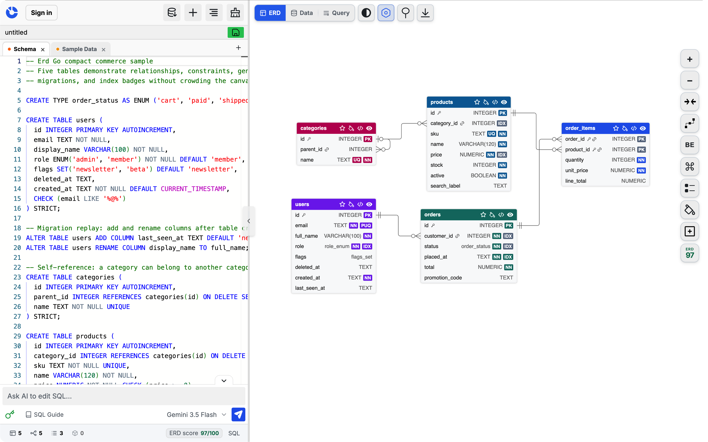

<p align="center">
  
</p>

<h1 align="center">ERD Go</h1>

<h3 align="center">Free, local-first SQL-to-ERD converter and database diagram editor.</h3>

<p align="center">PostgreSQL · MySQL · SQLite · SQL Server · No account</p>

<p align="center">
  <a href="https://erdgo.com/">
    
  </a>
  <a href="https://x.com/Erd_Go">
    
  </a>
</p>

<p align="center">
  
</p>

<p align="center"><strong>If ERD Go helps you, please star the repository so more developers can discover it.</strong></p>

## SQL to ERD in your browser

ERD Go is a browser-based database schema visualizer. Paste or import SQL DDL and instantly generate an interactive entity-relationship diagram—without creating an account or sending your schema to an application backend.

It understands common `CREATE TABLE` and `ALTER TABLE` workflows, primary and foreign keys, indexes, constraints, enums, composite types, and views across popular SQL dialects.

## Highlights

- Convert PostgreSQL, MySQL, SQLite, and SQL Server schemas into ER diagrams.
- Explore relationships, arrange tables, apply colors, and navigate with a minimap.
- Export database diagrams as PNG, SVG, or PDF.
- Replay schema and sample-data SQL in Data View.
- Run supported read-only `SELECT` queries in Query View.
- Save diagrams locally in your browser and reopen them later.
- Optionally edit SQL with Gemini using your own API key.

## Common uses

- Visualize an existing database schema from SQL.
- Design and document relational database structures.
- Review tables, keys, constraints, and relationships.
- Create shareable ERD exports for development and documentation.

## Run locally

```bash
git clone https://github.com/tanlee102/ErdGo.git
cd ErdGo
npm install
npm run dev
```

## Privacy

Diagrams stay in your browser. ERD Go has no accounts, cloud sync, sharing service, or analytics.

## License

[MIT](LICENSE)
